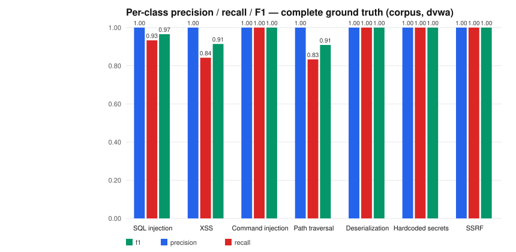
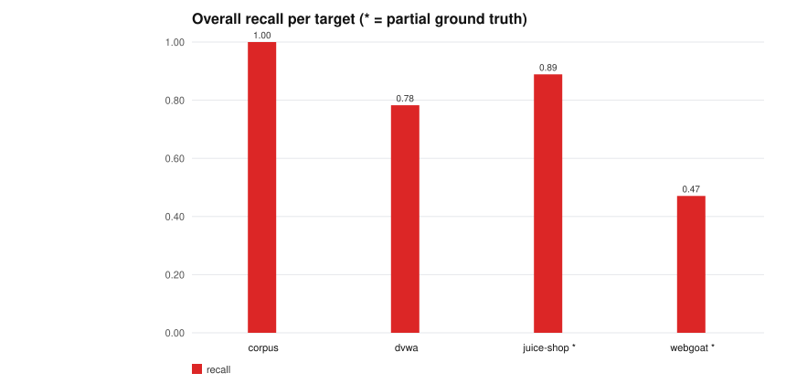
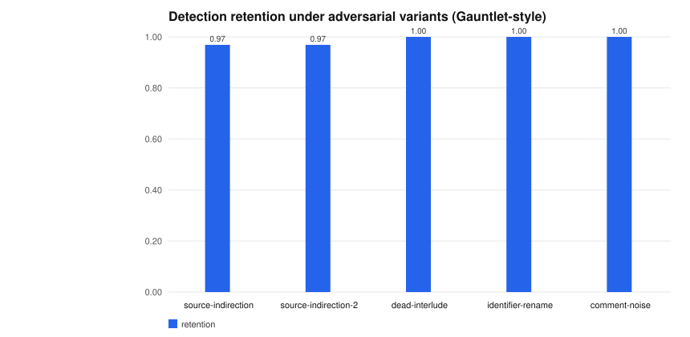

# SENTINEL benchmark results

This document reports measured detection performance of SENTINEL 4.1.0 against
labeled ground truth, and its robustness against source-level adversarial
variants. Every number below was produced by the scripts in `bench/` on the
pinned commits listed in §2. Raw results: `results/benchmark_results.json`,
`results/robustness_results.json` (generated, not committed); charts in
`results/charts/` are rendered from those files by `bench/make_charts.py`.

**Rules of the benchmark**

- Practice targets only: the labeled sample corpus in `bench/corpus/` and three
  deliberately vulnerable training applications (DVWA, OWASP Juice Shop,
  OWASP WebGoat). Nothing else was ever scanned, and the practice targets were
  never run as services — only their source code was scanned.
- Ground truth is hand-labeled by file (see `bench/groundtruth/*.json`). For
  two applications only a subset of files is labeled; those are marked
  **partial** and their precision is not computable — recall is measured
  against the labeled subset only.
- Matching is file-level: a target file is a true positive for class C if
  SENTINEL reports class C anywhere in that file.
- No rule was tuned against any target after its numbers below were recorded.

## 1. Headline results

Over the two targets with complete ground truth (the labeled corpus and DVWA):
**57 true positives, 0 false positives, 5 missed — precision 1.00, recall 0.92,
F1 0.96.** Zero false positives across all four targets.

| target | ground truth | TP | FP | FN | precision | recall | F1 |
|---|---|---:|---:|---:|---:|---:|---:|
| labeled corpus (46 files) | complete | 39 | 0 | 0 | 1.00 | 1.00 | 1.00 |
| DVWA @ `b496a5d` | complete | 18 | 0 | 5 | 1.00 | 0.78 | 0.88 |
| Juice Shop @ `1618a61` | partial | 8 | 0 | 1 | 1.00* | 0.89 | 0.94 |
| WebGoat @ `3284a8e` | partial | 8 | 1 | 9 | 0.89* | 0.47 | 0.62 |
| **aggregate, complete targets** | | **57** | **0** | **5** | **1.00** | **0.92** | **0.96** |

\* Precision against partial ground truth is only an upper bound: findings in
unlabeled files (18 in Juice Shop, 13 in WebGoat) are reported but not scored.




## 2. Targets and reproducibility

| target | source | pinned commit | how it was scanned |
|---|---|---|---|
| labeled corpus | vendored in `bench/corpus/` | n/a (in-tree) | whole directory |
| DVWA | github.com/digininja/DVWA | `b496a5d3de6b967410155e1b7d3e51e9d035eb22` | `vulnerabilities/` subtree |
| Juice Shop | github.com/juice-shop/juice-shop | `1618a611b173b4bf114028e6e02549950606e29d` | whole repo |
| WebGoat | github.com/WebGoat/WebGoat | `3284a8e466dfde083858f681e89aabb94e8b9c9e` | `src/main/java/org/owasp/webgoat/lessons/` |

`bench/fetch_targets.sh` clones these exact commits; `bench/run_benchmark.py`
records the commit actually scanned into the results JSON (`actual_commit`).
Reproduce with:

```bash
bash bench/fetch_targets.sh                       # clones into /tmp/bench-targets
python bench/run_benchmark.py --targets-dir /tmp/bench-targets
python bench/run_robustness.py                    # §5
python bench/make_charts.py                       # §1 charts
```

Scan cost: DVWA `vulnerabilities/` (25 files, 852 lines) scans in 0.03 s.
The scanner is standard-library-only and needs no installation.

## 3. Per-class results

Complete-ground-truth targets (corpus + DVWA). Classes absent from a target
are omitted from its columns.

| class | TP | FP | FN | precision | recall | F1 |
|---|---:|---:|---:|---:|---:|---:|
| SQL injection | 14 | 0 | 1 | 1.00 | 0.93 | 0.97 |
| XSS | 16 | 0 | 3 | 1.00 | 0.84 | 0.91 |
| command injection | 8 | 0 | 0 | 1.00 | 1.00 | 1.00 |
| path traversal | 5 | 0 | 1 | 1.00 | 0.83 | 0.91 |
| insecure deserialization | 5 | 0 | 0 | 1.00 | 1.00 | 1.00 |
| hardcoded secrets | 5 | 0 | 0 | 1.00 | 1.00 | 1.00 |
| SSRF | 4 | 0 | 0 | 1.00 | 1.00 | 1.00 |

Partial targets, for the record:

- **Juice Shop** (partial): SQL injection 3/3, XSS 1/1, SSRF 1/1, secrets 1/1,
  path traversal 2/3 (miss: `routes/fileServer.ts` — see §4).
- **WebGoat** (partial): SQL injection 5/11, path traversal 1/3,
  deserialization 1/2, SSRF 1/1; one false positive (see §4).

## 4. Every miss and false positive, with reasons

Honest accounting — these are all 15 non-correct (file, class) judgments:

**DVWA misses (5)**

| file | class | why it is missed |
|---|---|---|
| `vulnerabilities/xss_s/source/low.php` | xss | stored XSS via `$_POST['txt']` echoed after a SQL round-trip; the taint model does not follow data through database reads |
| `vulnerabilities/xss_s/source/medium.php` | xss | same stored-XSS pattern at medium difficulty |
| `vulnerabilities/xss_s/source/high.php` | xss | same stored-XSS pattern at high difficulty |
| `vulnerabilities/sqli/source/low.php` | sql_injection | session-carried taint: the query runs against an id stored in `$_SESSION` by another page |
| `vulnerabilities/fi/index.php` | path_traversal | cookie-carried taint: `$_COOKIE['file']` is not modeled as a source |

The pattern in all five: taint that arrives through storage (DB rows, session,
cookies) rather than the current request. This is a real coverage boundary of
the analyzer, not a labeling problem. They stay misses on purpose — adding
DB/session sinks without a flow-sensitive model would create false positives
elsewhere in the same targets.

**Juice Shop miss (1)**

| file | class | why it is missed |
|---|---|---|
| `routes/fileServer.ts` | path_traversal | `res.sendFile(path.resolve('ftp/', file))` — `path.resolve` normalizes the join, and the guard `!file.includes('/')` looks restrictive to the guard model (it blocks slashes but not encoded traversal, which is exactly the real-world flaw) |

**WebGoat misses (9)**

| file | class | why it is missed |
|---|---|---|
| `.../sqlinjection/introduction/SqlInjectionLesson5.java` | sql_injection | query built across multiple statements/methods; taint is carried through fields the model does not track |
| `.../sqlinjection/introduction/SqlInjectionLesson5a.java` | sql_injection | same multi-hop field-carried taint |
| `.../sqlinjection/introduction/SqlInjectionLesson5b.java` | sql_injection | same |
| `.../sqlinjection/introduction/SqlInjectionLesson8.java` | sql_injection | same |
| `.../sqlinjection/introduction/SqlInjectionLesson10.java` | sql_injection | same |
| `.../sqlinjection/advanced/SqlInjectionLesson6a.java` | sql_injection | same |
| `.../pathtraversal/ProfileUploadBase.java` | path_traversal | filename joined into a destination path via helper methods |
| `.../pathtraversal/ProfileZipSlip.java` | path_traversal | zip-slip: entry names extracted from archive entries, not request parameters |
| `.../deserialization/SerializationHelper.java` | insecure_deserialization | `ObjectInputStream.readObject()` behind a generic helper; the call is legit-shaped so the deserialization rule does not fire |

**WebGoat false positive (1)**

| file | class | judgment |
|---|---|---|
| `.../sqlinjection/advanced/SqlInjectionLesson6b.java` | hardcoded_secrets | the lesson hardcodes `String password = "dave"` — a default credential in real code, but here it is lesson content (the user is told the password). SENTINEL reports it; the label says it is not a vulnerability. Borderline by design; reported rather than suppressed |

**Ground-truth correction made during labeling:** WebGoat
`ProfileUploadRetrieval.java` was initially treated as a SENTINEL false
positive for `path_traversal`. Reading the code, it *is* a CWE-22
(`new File(directory, request.getParameter("id") + ".jpg")` — unvalidated
request value joined into a filesystem path), so the ground truth was
corrected, not the scanner. That file is now a true positive.

## 5. Robustness under adversarial variants (Gauntlet-style)

Gauntlet, the offensive counterpart to this project, is defined but not public
here (`bench/gauntlet/INTERFACE.md` specifies the exact CLI contract and
manifest format). The benchmark runs that interface: if a `gauntlet` binary is
on `PATH` it is used; otherwise the bundled fallback generator
(`bench/gauntlet/local_mutator.py`) produces the same contract. All numbers
below come from the fallback generator, seed 42.

Five techniques applied to all 39 vulnerable corpus files, keeping semantics
and the vulnerability intact:

- **source-indirection** — route the taint source through one temporary variable
- **source-indirection-2** — same, through two chained temporaries
- **dead-interlude** — insert an unrelated assignment between source and sink
- **identifier-rename** — rename declared variables consistently
- **comment-noise** — insert misleading comments and padding

Retention = fraction of variants where SENTINEL still reports the labeled
class (baseline: 39/39 files detected before mutation).

| technique | variants | still detected | missed | retention |
|---|---:|---:|---:|---:|
| source-indirection | 32 | 31 | 1 | 97% |
| source-indirection-2 | 32 | 31 | 1 | 97% |
| dead-interlude | 33 | 33 | 0 | 100% |
| identifier-rename | 27 | 27 | 0 | 100% |
| comment-noise | 33 | 33 | 0 | 100% |
| **all variants** | **157** | **155** | **2** | **99%** |

(Variant counts differ because each technique only applies where its transform
is legal — e.g. `identifier-rename` skips files with no renameable variables.)



The two misses are the same file: `sqli_js_nosql_05.js`, a NoSQL operator
injection, under source-indirection. Its filter argument
(`{ email: req.body.email }`) is flagged because the request reference appears
directly in the query document; once the request object is routed through a
temporary, the direct-reference trigger no longer fires and there is no
operator shape to fall back on. This is a genuine robustness gap in the NoSQL
rule's source model, documented here rather than patched after seeing the
result.

Reading the result plainly: the detector is flow- and context-based, so the
tested obfuscations mostly do not move it — the corpus was built before the
robustness harness existed, and the transforms are simple. This is a floor,
not a ceiling; a real Gauntlet run would add control-flow flattening,
multi-file rewrites, and semantic-preserving restructuring that lexical
transforms cannot express.

## 6. Limitations

- **File-level matching.** A file counts as detected if any finding of the
  right class lands anywhere in it. Line-level metrics would be stricter; they
  need line-accurate ground truth, which these applications do not ship.
- **Partial ground truth on the applications.** Only corpus + DVWA have
  complete labels, so the headline precision figure covers those two. WebGoat's
  Java lessons concentrate multi-line, field-carried taint, which the analyzer
  demonstrably under-covers (0.47 recall there).
- **Storage-borne taint is out of scope** for this version (DB reads, session,
  cookies) — the cause of all five DVWA misses.
- **Robustness numbers use the fallback generator**, not the full Gauntlet
  implementation; techniques are documented in
  `bench/gauntlet/INTERFACE.md` and are intentionally lexical.
- **The corpus is developed against.** The labeled corpus was used while
  building the rule set, so corpus numbers are in-sample; DVWA, Juice Shop and
  WebGoat were labeled after detection runs and are out-of-sample. That is why
  the aggregate headline uses the two complete-ground-truth targets rather
  than the corpus alone.
