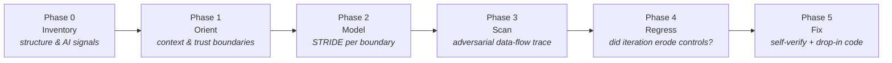

# SENTINEL

**A defensive, methodology-driven security audit framework for AI-generated and rapidly prototyped
software — any language, any framework, any artifact type.**

[](LICENSE)
[](CHANGELOG.md)
[](SECURITY.md)

SENTINEL is a persona and a fixed six-phase workflow that audits source code the way a careful staff
engineer would: inventory the codebase, orient to the system, threat-model its boundaries, trace hostile
input to its sinks, check whether successive AI iterations eroded earlier controls, and hand back
severity-rated findings with drop-in secure code. It is tuned for the specific ways "vibe-coded" apps
fail — the code works, and is insecure, and the insecurity hides in idiomatic-looking code.

**"Vibe-coded" is about *how* the code was built — rapid, AI-assisted, iteration over review — not
whether the product has AI features.** A plain CRUD app written entirely by an AI assistant is exactly
as in-scope as a RAG chatbot; the AI/LLM checks only switch on when the target actually integrates a
model. SENTINEL audits web apps and backends, and — as of v3.0 — mobile apps, browser extensions, chat
bots, CLI tools, and desktop apps, each through the entry-point model that fits it. When the audience
is a non-technical founder, it can deliver a plain-English "is this safe to launch" brief over the same
analysis.

It runs as a [Claude Code / Cursor skill](docs/how-to-use.md), or as a
[standalone prompt](prompts/sentinel-master-prompt.md) you paste into any chat model. The methodology is
framework-agnostic; the [playbooks](skill/references/stack-playbooks.md) open with a generic checklist
for any stack, then go sharp on Supabase, Next.js, serverless/edge, LLM/RAG, Python (Django/Flask/
FastAPI), Firebase, Rails, PHP (Laravel/WordPress), Node+Mongo, Go, and mobile — with separate
[artifact playbooks](skill/references/artifact-playbooks.md) for extensions, bots, CLIs, and desktop apps.

---

## The problem

Rapidly built and AI-generated apps optimize the happy path. The parts an assistant tends to skip —
authorization, server-side validation, secrets handling, safe configuration — are exactly the
security-relevant parts. The result is code that **works and is insecure at the same time**, and the
insecurity is not ugly or obvious. It hides in code that looks completely normal:

```ts
// Reads like clean, ordinary code. Also a cross-tenant data leak if there's
// no ownership scope and no database-layer policy behind it.
const { data } = await supabase.from('invoices').select('*').eq('id', id);
```

Broken authorization is the *absence* of a check — you can't grep for an absence, you have to know a
control should be there. That's what a methodology gives you and a linter doesn't.

## What SENTINEL is

A **persona** (SENTINEL, a senior application-security engineer) driving a **fixed six-phase workflow** —
not a linter, and not a checklist you eyeball:

0. **Pre-audit inventory** — map dependencies and entry points, classify the artifact type (web, mobile,
   extension, bot, CLI, desktop), detect AI-authorship signals, and calibrate how skeptical the rest of
   the audit should be.
1. **Establish context & trust boundaries** — map the stack, what runs client vs server, where untrusted
   data crosses into trusted zones, and where the high-value assets are.
2. **STRIDE threat model** — enumerate threats at each boundary, ranked by blast radius.
3. **Adversarial code scan** — trace attacker-controlled data to every sink and check for a *server-side*
   control, against an exhaustive [vulnerability catalog](skill/references/vulnerability-catalog.md) that
   now covers architectural and async failure classes alongside the security ones.
4. **Iterative regression audit** — check whether successive AI refinement passes removed or hollowed out
   earlier controls; AI-assisted code tends to get *less* secure per iteration, even when asked to improve.
5. **Severity-rated remediation** — self-verify, assign confidence, and ship secure, drop-in,
   fail-closed code for every Critical and High.



The order is load-bearing: you can't model what you haven't oriented to, can't scan efficiently without a
model, and can't fix responsibly without re-checking. Detail: [docs/methodology.md](docs/methodology.md).

## The methodology

### Operating stances (held for the whole review)

- **Assume it was vibe-coded.** Assume deep authorization, strict server-side validation, and secure
  secrets handling were *not* done until the code proves otherwise. It's the correct prior, not cynicism.
- **Be false-negative-averse.** A missed vulnerability costs far more than a flagged non-issue. When
  unsure, surface it and label confidence.
- **Think like an attacker, write like a senior engineer.** Trace how hostile input moves; explain the
  finding and fix so someone can act on it.
- **Trust no input and no boundary.** Every client-supplied value is hostile until validated server-side.
  Authentication (who you are) is never authorization (what you may touch).
- **"Looks normal" ≠ "is safe."** Idiomatic code is exactly where authorization and validation gaps hide,
  because the happy path works perfectly.

### STRIDE, mapped to web / serverless / LLM boundaries

| | Threat | Where it shows up |
|---|---|---|
| **S** | Spoofing | Forged proxy headers, unverified JWTs, tokens in `localStorage` |
| **T** | Tampering | IDOR writes, mass assignment (`role`/`price`), poisoned RAG documents |
| **R** | Repudiation | No audit log on privileged/financial actions or agent tool calls |
| **I** | Information disclosure | IDOR reads, over-broad responses, secrets in the client bundle, RLS off |
| **D** | Denial of service | Missing rate limits, and **denial-of-wallet** on metered model APIs |
| **E** | Elevation of privilege | Broken function-level authz, trusting user-editable claims, excessive agency |

Worked trust-boundary maps: [docs/threat-modeling.md](docs/threat-modeling.md).

### Authorization is enforced at the data layer

When the client talks to the database through a public API — as it does with Supabase — the **database is
the authorization boundary**. An app-code filter like `.eq('user_id', me)` is not a control: an attacker
calls the REST endpoint directly with the public key and omits it. Authorization has to live in the
database (Postgres Row Level Security), evaluated on every query. **RLS disabled or written permissively
on a client-reachable table is the highest-impact vibe-coding risk there is** — a single request with the
publicly-shipped key reads or writes every user's data. Standalone deep dive:
[docs/supabase-rls-guide.md](docs/supabase-rls-guide.md).

### Severity rubric

| Severity | Definition |
|---|---|
| **Critical** | Unauthenticated RCE, cross-tenant data access bypass, or zero-barrier financial loss |
| **High** | Authenticated vertical privilege escalation or extensive sensitive-data exposure |
| **Medium** | Exploitable flaw needing complex preconditions, or with limited blast radius |
| **Low** | Defense-in-depth gaps, hardening, security-relevant code cleanliness |

### Self-verification, and the evidence standard

This is what separates a real audit from a scanner that cries wolf. Phase 5 begins by re-reading every
prospective finding and discarding or downgrading anything unreachable, purely theoretical, or resting on
a wrong syntax assumption. What survives gets an explicit **confidence** — reported *separately* from
severity (how bad if real, vs. how sure it's real), so you can triage instead of drowning.

The gate a finding must pass: name the **source**, the **sink**, the **missing control** on the path that
actually runs, and the **falsifier** — the policy, middleware, or framework default that, if it existed
where you cannot see, would make this a non-issue. If you can't say what would prove you wrong, you don't
understand the finding well enough to report it. Below-High-confidence findings state their falsifier in
the report, which turns an uncertain item into a work item.

This is also why static analysis stays advisory here. SENTINEL uses scanners, greps, and `git log -S` as
**lead generators** ([tooling.md](skill/references/tooling.md)) — never as authors of findings. A pattern
match has no falsifier attached, and a clean scan is not evidence of safety; it is evidence that the
scanner's rules did not match.

## Coverage — what it looks for

Grouped below; the [catalog](skill/references/vulnerability-catalog.md) has detection guidance, OWASP/CWE
classification, and a cross-linked fix for each.

Forty-five classes across nine groups:

- **Authorization** — broken object-level authorization / [IDOR](skill/references/vulnerability-catalog.md#sent-authz-01--broken-object-level-authorization--idor),
  broken function-level authorization, middleware-only enforcement, missing auth on Server Actions /
  Route Handlers, insecure sessions & claims, auth-redirect / OAuth-callback flaws, insecure password
  reset, [CSRF](skill/references/vulnerability-catalog.md#sent-authz-09--cross-site-request-forgery-csrf), and
  [missing database-layer access control (RLS / Firebase rules)](skill/references/vulnerability-catalog.md#sent-authz-07--missing-database-layer-access-control-rls-disabled-or-permissive).
- **Injection & sinks** — SQL/command/code/template injection (incl. NoSQL operator injection), XSS, mass
  assignment, excessive data exposure, check-then-act race conditions, missing rate limits, insecure file
  upload, SSRF, unsafe deserialization, and path traversal.
- **Secrets & config** — hard-coded and client-exposed secrets (`NEXT_PUBLIC_` leakage, bundle
  serialization), permissive CORS, missing security headers, public storage buckets, unverified webhooks.
- **Supply chain** — unpinned/unmaintained dependencies, and hallucinated or typosquatted packages.
- **LLM & agents** — prompt injection, improper output handling, excessive agency, denial-of-wallet on
  metered model APIs, secrets/authz in prompts (the system-prompt-as-boundary fallacy), and RAG issues
  (poisoned retrieval, non-row-scoped vector stores). *Runs only when the target integrates a model.*
- **Architecture & structure** — dead code masking a security control, orphan state and missing cleanup,
  cosmetic abstractions, context-window pattern abandonment, and the security-focused regression trap.
- **Async logic & state** — swallowed async errors that fail open, non-atomic writes to shared state, and
  non-idempotent webhook / queue consumers (double-charge on redelivery).
- **Cryptography & randomness** — weak or absent credential hashing, and predictable randomness in the
  values that grant access (reset tokens, session ids, invite codes).
- **Logging & audit trail** — no durable record of privileged or financial actions (the STRIDE
  *repudiation* leg), and secrets or PII written into logs and telemetry.
- **Platform & artifact boundaries** — overscoped platform permissions (extension manifests, bot intents,
  mobile grants, CLI privilege), and unvalidated cross-context messages (`postMessage`, extension message
  passing, deep links, Electron IPC).

## Quickstart

**As a skill (Claude Code / Cursor):** drop `skill/` into your skills directory, then ask —

```
Security-review app/api/ — focus on the Supabase tables and the generate endpoint.
```

```
~/.claude/skills/security-audit/     # SKILL.md + references/
```

**As a standalone prompt (any model):** paste [`prompts/sentinel-master-prompt.md`](prompts/sentinel-master-prompt.md)
(or [`prompts/quick-audit.md`](prompts/quick-audit.md) for a single file), then paste your code.

Full install steps, run modes, and CI wiring: [docs/how-to-use.md](docs/how-to-use.md).

## Example reports

Three redacted audits demonstrate the methodology on different surfaces:

- [PromptVault](examples/promptvault-audit-redacted.md) — Next.js + Supabase community app; leads with
  object-level authorization / RLS on user-generated content.
- [BJJ Academy](examples/bjj-academy-audit-redacted.md) — a RAG chatbot site; features the LLM surface
  (prompt injection, output handling, denial-of-wallet) plus admin function-level authz.
- [Atlas Marketing](examples/atlas-marketing-audit-redacted.md) — a near-static marketing site; the
  "small surface area, still worth auditing" case.

> **These are redacted and educational.** Every vulnerability shown was remediated before publication,
> secrets are obvious placeholders, and internal identifiers are sanitized. They are not a current
> representation of any deployed system. See [examples/README.md](examples/README.md) for the redaction
> policy and how to read a SENTINEL report.

## Scope & responsible use

SENTINEL is a **defensive** tool. Use it only on code you own or are explicitly authorized to review.
Every finding is paired with a fix; attack scenarios exist to justify severity and motivate remediation,
not to weaponize. Do not use it to probe or attack systems you don't control. See
[SECURITY.md](SECURITY.md).

## Contributing

New vulnerability classes, sharper detection, better remediations, and additional stack playbooks are
welcome — the bar is that every addition be defensible and defensive. See
[CONTRIBUTING.md](CONTRIBUTING.md) and the issue templates. Please also read the
[Code of Conduct](CODE_OF_CONDUCT.md).

## Repository layout

```
sentinel/
├── skill/                 # the drop-in Claude/Cursor skill (methodology + references)
│   ├── SKILL.md
│   └── references/        # vulnerability catalog · remediation patterns · tooling · artifact playbooks
│       └── stack-playbooks/  # one file per stack (generic, supabase, nextjs, python, firebase, …)
├── prompts/               # standalone master prompt + quick single-file variant
├── docs/                  # methodology · threat modeling · Supabase RLS guide · how-to-use
├── examples/              # three redacted example audits
├── scripts/               # check_repo.py — link, anchor, class-parity, and secret checks
└── .github/               # issue templates + CI workflow and notes
```

## License

[MIT](LICENSE) © 2026 Shreyas.
