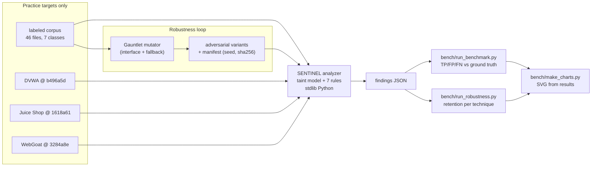

# SENTINEL

**A static vulnerability scanner with a published benchmark: precision 1.00, recall 0.92 (F1 0.96) on practice targets with complete ground truth, and 99% detection retention against adversarial code variants.**

[](https://github.com/shreyas-tech7/sentinel/actions/workflows/ci.yml)
[](LICENSE)
[](CHANGELOG.md)
[](SECURITY.md)

SENTINEL scans source code for seven classes of injection and exposure flaws —
SQL injection (including NoSQL operator injection), XSS, command injection,
path traversal, unsafe deserialization, hardcoded secrets, and SSRF — across
PHP, Python, JavaScript/TypeScript, Java, and Go. It tracks taint from request
sources to dangerous sinks, distinguishes *string-context* from *parameterized*
queries, recognizes security controls (prepared statements, `escapeshellarg`,
allowlists, sanitizers) so it does not flag defended code, and emits
severity-rated findings with drop-in fixes. It is standard-library Python, no
installation, and every number it claims is produced by a script in this
repository. Full methodology, catalog, and audit playbooks: below in
[Methology and coverage](#methodology-and-coverage).

**Scope rule, up front:** SENTINEL and its benchmark tooling run only against
code you own, or against the deliberately vulnerable practice targets this repo
pins (DVWA, OWASP Juice Shop, OWASP WebGoat, and the vendored labeled corpus).
See [SECURITY.md](SECURITY.md).

---

## A run

Real output from this repository, pasted verbatim (a terminal capture adds
nothing over the text, so the text is what you get):

```console
$ python -m sentinel scan bench/corpus/sql_injection/sqli_php_mysqli_01.php --table

SENTINEL 4.1.0 — scanned 1 files, 8 lines in 0.001s

SEVERITY  CLASS                    LOCATION                                       RULE
--------------------------------------------------------------------------------------
HIGH      sql_injection            sqli_php_mysqli_01.php:6                       SENT-INJ-01/SQLI

total findings: 1
  sql_injection            1
```

## Quickstart

No install. Python 3.10+ standard library only.

```bash
git clone https://github.com/shreyas-tech7/sentinel.git
cd sentinel

# scan a directory you own
python -m sentinel scan path/to/code --table

# machine-readable report
python -m sentinel scan path/to/code --json report.json

# limit to certain paths (glob or prefix, repeatable)
python -m sentinel scan path/to/code --include "routes/" --include "*.py"

# run against a single file with the full metrics table
python -m sentinel scan app/db.php --table
```

To reproduce the benchmark:

```bash
bash bench/fetch_targets.sh            # clones pinned DVWA / Juice Shop / WebGoat
python bench/run_benchmark.py          # writes results/ + tables
python bench/run_robustness.py         # adversarial-variant retention (§ below)
python bench/make_charts.py            # renders charts from the results files
python -m unittest discover -s tests   # 86 tests
```

## Headline metrics

Every figure is measured, scripted, and reproducible; details, per-class
tables, and the full miss list are in [BENCHMARKS.md](BENCHMARKS.md).

**Detection** (file-level matching against hand-labeled ground truth):

| target | TP | FP | FN | precision | recall | F1 |
|---|---:|---:|---:|---:|---:|---:|
| labeled corpus (46 files, 7 classes) | 39 | 0 | 0 | 1.00 | 1.00 | 1.00 |
| DVWA @ pinned commit | 18 | 0 | 5 | 1.00 | 0.78 | 0.88 |
| Juice Shop @ pinned commit (partial labels) | 8 | 0 | 1 | 1.00* | 0.89 | 0.94 |
| WebGoat @ pinned commit (partial labels) | 8 | 1 | 9 | 0.89* | 0.47 | 0.62 |
| **aggregate, complete ground truth** | **57** | **0** | **5** | **1.00** | **0.92** | **0.96** |

\* upper bound — findings in unlabeled files are not scored.

**Robustness** (39 vulnerable files put through 157 adversarial variants —
taint routed through temporaries, dead interludes, identifier renames,
comment noise): **155/157 still detected (99% retention)**. The two misses are
one NoSQL-injection sample whose request reference was routed through a
temporary — a documented gap, not a patched one.

## Architecture: SENTINEL + Gauntlet

Gauntlet is the offensive counterpart: a deterministic mutator that rewrites
*already-labeled practice samples* into obfuscated variants while preserving
their semantics — source indirection, dead interludes, identifier renames,
comment noise. It exists in this repository as a documented interface
([bench/gauntlet/INTERFACE.md](bench/gauntlet/INTERFACE.md)) plus a bundled
fallback generator that implements the same contract; a full Gauntlet
implementation can be dropped in by putting a `gauntlet` binary on `PATH`.



The loop is the point: Gauntlet answers "does the detector still see a flaw
that has been cosmetically disguised?", which raw precision/recall cannot.

## What the detector does

Per file, SENTINEL builds a small taint model, then runs seven rules over it
with context the raw regex never sees:

- **Sources** — PHP superglobals, `request.*` in Flask/Django/Express, Angular
  `queryParams`/`location` values, `window.location.*`, Java
  `@RequestParam`/`@PathVariable` parameters, Go `r.URL.Query().Get(...)` /
  `r.FormValue(...)`.
- **Propagation** — assignment chains, string-built queries
  (`"SELECT ... '$id'"`, JS template literals, Python f-strings, `fmt.Sprintf`),
  and concatenation adjacency; `intval`/`abs`/`floatval` defuse,
  `mysqli_real_escape_string` and friends *do not* (escape-in-quote is a known
  bypass), and `is_numeric`-fenced tokens are honored.
- **Controls** — prepared/parameterized statements, `escapeshellarg`,
  argument-list `exec`, `path.basename` + `root:`, `DOMPurify`,
  `htmlspecialchars`, allowlist guards (`in_array`, `.includes()`,
  `.startsWith()`), `yaml.safe_load`, env-var lookups.
- **Secrets** — name-keyed detection plus value shapes (AWS keys, Stripe keys,
  private-key blocks, JWTs), with guards so `if (password === input)` and
  literals inside SQL strings are not reported.

Findings carry `rule_id`, CWE, severity, confidence, the flagged line, and a
remediation reference; the [catalog](skill/references/vulnerability-catalog.md)
pairs all 45 documented classes with drop-in fixes.

## What I learned

- **Zero false positives is a design decision, not luck.** Every rule gates on
  *context* (string-context vs parameterized, control present vs absent), not
  on scary words. The corpus holds at 1.00 precision because "flag when a
  control is missing" is checkable; "flag when it looks risky" is not.
- **The misses cluster into two causes.** All five DVWA misses are taint
  arriving through storage (DB rows, sessions, cookies) — a flow the analyzer
  deliberately does not model. Nearly all WebGoat misses are Java taint carried
  through fields across methods. Knowing *which* limitation costs you recall is
  worth more than a higher number that hides it.
- **Ground truth is part of the experiment.** One "false positive"
  (`ProfileUploadRetrieval`) turned out to be a real path traversal on re-read,
  so the label was corrected, not the scanner. Label review found a real
  detection, not a regression.
- **Robustness harnesses catch mutator bugs first.** My first variant run
  showed 0% retention — because the mutator rewrote its own inserted lines.
  A suspiciously perfect or terrible number usually indicts the harness, not
  the tool under test. The published 99% is measured only after the transforms
  were verified to preserve semantics.
- **Charts from the results file, always.** `bench/make_charts.py` renders the
  SVGs from `results/*.json`; there is no way to draw a number that the JSON
  does not contain.

## Engineering decisions

- **Stdlib only.** No pip install, no tree-sitter, no semgrep: the scanner and
  all benchmark tooling run anywhere Python 3.10 runs, and CI has no install
  step. The cost is hand-rolled lightweight parsing; the benefit is that the
  tool is trivially auditable and runnable.
- **Regex rules over a context model, not instead of one.** Patterns find
  candidates; the taint context (per-file var map, string-context tracking,
  control recognition) decides. Either alone is weak: context-less regex spams,
  pure AST analysis without stdlib parsers is a rewrite per language.
- **File-level matching for scoring.** Line-accurate ground truth does not
  exist for these applications; file+class matching is checkable and honest.
  Documented in [BENCHMARKS.md](BENCHMARKS.md) as a limitation, not hidden.
- **The benchmark only scores what is labeled.** Partially-labeled targets
  report recall only, marked partial; nothing is silently dropped or counted.
- **Gauntlet as a contract, not a dependency.** The variant generator is
  swappable behind a CLI + manifest spec (`INTERFACE.md`), so the robustness
  numbers name their generator, seed, and hashes — and a stronger Gauntlet can
  rerun the same harness.
- **Rules were frozen before the final numbers were recorded.** After the
  labeled corpus reached its tuned state, no rule was edited in response to
  any application-target result. The remaining misses are reported as-is.

## Methodology and coverage

SENTINEL began as an audit methodology for AI-generated and rapidly prototyped
software, and the deterministic analyzer above is its automatable core. The
full material remains here:

- The six-phase methodology: [docs/methodology.md](docs/methodology.md)
- Vulnerability catalog (45 classes, with fixes):
  [skill/references/vulnerability-catalog.md](skill/references/vulnerability-catalog.md)
- Remediation patterns: [skill/references/remediation-patterns.md](skill/references/remediation-patterns.md)
- STRIDE per boundary: [docs/threat-modeling.md](docs/threat-modeling.md)
- Supabase RLS deep dive: [docs/supabase-rls-guide.md](docs/supabase-rls-guide.md)
- As a Claude Code / Cursor skill: [docs/how-to-use.md](docs/how-to-use.md)
- As a standalone prompt: [prompts/sentinel-master-prompt.md](prompts/sentinel-master-prompt.md)
- Redacted example audits: [examples/](examples/README.md)

The analyzer covers the automatable subset (injection, XSS, secrets, SSRF,
deserialization, traversal). Authorization flaws, RLS gaps, and the
architectural classes still need the methodology — an absence of a check is
not greppable, which is the original reason SENTINEL exists.

## Repository layout

```
sentinel/
├── sentinel/              # the scanner: taint model, 7 rules, CLI, JSON API
├── bench/
│   ├── corpus/            # 46 labeled practice samples (38 vulnerable / 8 clean)
│   ├── groundtruth/       # labels for corpus + DVWA + Juice Shop + WebGoat
│   ├── gauntlet/          # variant-generator interface + fallback mutator
│   ├── fetch_targets.sh   # clones pinned practice targets
│   ├── run_benchmark.py   # TP/FP/FN, per-class + per-target tables
│   ├── run_robustness.py  # adversarial-variant retention harness
│   └── make_charts.py     # SVG charts rendered from the results JSON
├── results/               # generated (gitignored): JSON, tables, charts
├── tests/                 # 86 tests: rules, taint, scanner, CLI, mutator
├── skill/ prompts/ docs/ examples/   # methodology, catalog, playbooks, audits
├── scripts/check_repo.py  # link/anchor/parity/secret invariants
└── .github/workflows/     # CI: structural integrity + secret scan
```

## Scope & responsible use

SENTINEL is a **defensive** tool. Run it only on code you own or are explicitly
authorized to review. The benchmark targets are deliberately vulnerable
training applications, used exactly as published for that purpose: cloned at
pinned commits, scanned as source, never deployed, never run as services, and
never pointed at anything else. Every finding pairs with a fix; attack
scenarios exist to justify severity, not to weaponize. See
[SECURITY.md](SECURITY.md).

## Contributing

New vulnerability classes, sharper detection, better remediations, and
additional stack playbooks are welcome — the bar is that every addition be
defensible and defensive. Rule changes must keep the benchmark green
(`python bench/run_benchmark.py --only corpus` runs in seconds). See
[CONTRIBUTING.md](CONTRIBUTING.md) and the issue templates.

## License

[MIT](LICENSE) © 2026 Shreyas.
